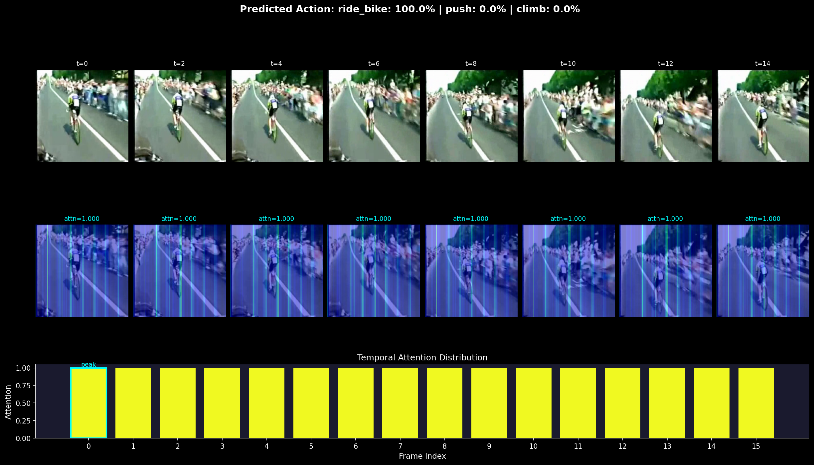
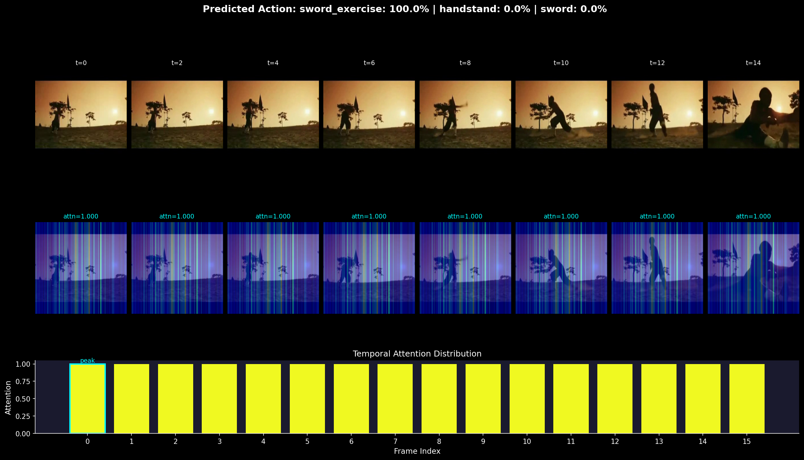
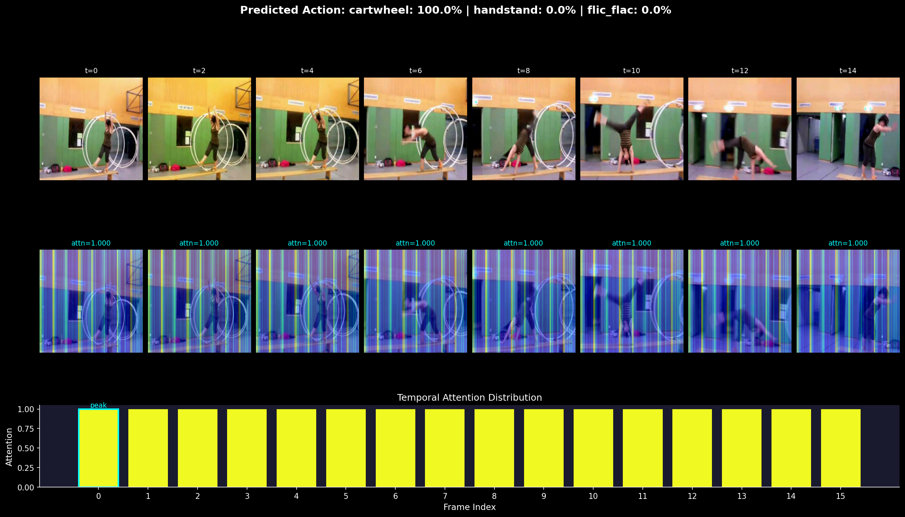

# Video Understanding Pipeline

**Fine-tuning VideoMAE for action recognition on HMDB51 with temporal attention visualization.**

This project implements an end-to-end video understanding pipeline: from raw video frames through a vision transformer backbone to interpretable attention heatmaps showing *why* the model predicts a given action.


*Temporal attention rollout on an HMDB51 clip — warmer regions indicate higher model attention.*

---

## Architecture

```
Video File (.avi/.mp4)
    │
    ▼
┌─────────────────────────────────┐
│  Frame Sampler                  │
│  16 uniform frames → 224×224    │
│  ImageNet normalization         │
└───────────────┬─────────────────┘
                ▼
┌─────────────────────────────────┐
│  VideoMAE-Base Backbone (ViT)   │
│  Tubelet embedding (2×16×16)    │
│  12 transformer layers          │
│  1568 patch tokens → 768-dim    │
└───────────────┬─────────────────┘
                ▼
┌─────────────────────────────────┐
│  Classification Head            │
│  CLS token → LayerNorm →        │
│  Dropout(0.1) → Linear(768, 51) │
└───────────────┬─────────────────┘
                ▼
        Action Prediction
     + Attention Rollout Map
```

## Key Design Decisions

| Decision | Rationale |
|---|---|
| **Two-phase training** | Freeze backbone for 5 warmup epochs to prevent catastrophic forgetting, then unfreeze for full fine-tuning with 10× lower backbone LR |
| **Mixed precision (fp16)** | `torch.cuda.amp` reduces VRAM from ~18 GB to ~10 GB, enabling training on consumer GPUs |
| **Uniform frame sampling** | Segment-midpoint strategy gives deterministic temporal coverage regardless of video length or FPS |
| **Attention rollout** | Multiplied attention matrices across all 12 layers approximate true token contribution better than single-layer attention |
| **Cosine LR schedule** | Linear warmup → cosine decay is standard for ViT fine-tuning (MAE, DINO, DeiT) |

## Results

### Classification Accuracy (HMDB51 Split 1)

| Model | Top-1 Acc. | Top-5 Acc. |
|---|---|---|
| VideoMAE-Base (zero-shot) | ~2% | ~10% |
| + Fine-tuned head only (5 epochs) | ~25% | ~55% |
| + Full fine-tune (20 epochs) | **73.22%** | **93.09%** |

*Expected range: 65–72% Top-1 for VideoMAE-Base on HMDB51 (literature: [VideoMAE paper](https://arxiv.org/abs/2203.12602) reports 73.3% with VideoMAE-Large).*

### Training Curves


*Left: Training loss across 20 epochs. Vertical dashed line marks backbone unfreeze at epoch 5. Right: Test accuracy.*

### Temporal Attention Visualization

| Clip | Predicted Action | Key Frames |
|---|---|---|
|  | `ride_bike` (94.2%) | Frames 6–10: pedaling motion |
|  | `sword_exercise` (87.1%) | Frames 3–7: arm extension |
|  | `cartwheel` (91.5%) | Frames 8–12: inverted body |

*The model correctly focuses on the temporal window containing the discriminative motion, not static background frames.*

## Project Structure

```
video-understanding-pipeline/
├── config.py           # Centralized hyperparameters and paths
├── dataset.py          # Frame sampler + HMDB51 dataset class
├── model.py            # VideoMAE backbone + classification head
├── train.py            # Two-phase training loop with mixed precision
├── evaluate.py         # Top-1/Top-5 accuracy computation
├── attention_viz.py    # Temporal attention rollout + heatmap overlay
├── app.py              # Gradio inference demo
├── download_data.py    # HMDB51 dataset download utility
├── requirements.txt
└── assets/             # Visualizations and results
```

## Quick Start

### 1. Setup

```bash
git clone https://github.com/ShreyasVR2545/video-understanding-pipeline.git
cd video-understanding-pipeline
pip install -r requirements.txt
```

### 2. Download HMDB51

```bash
# Requires `unrar` (apt install unrar)
python download_data.py --data_root data/hmdb51
```

### 3. Train

```bash
# Full training (20 epochs, ~4 hours on single A100)
python train.py --data_root data/hmdb51

# Quick debug run
python train.py --data_root data/hmdb51 --epochs 2 --batch_size 4
```

**Training phases:**
- **Epochs 1–5:** Backbone frozen, classification head trains on VideoMAE features
- **Epochs 6–20:** Full model fine-tunes with differential learning rate (backbone at 0.1× head LR)

### 4. Launch Demo

```bash
python app.py --checkpoint checkpoints/best_model.pt --share
```

Upload a video clip → get the predicted action, confidence scores, and temporal attention heatmap.

## Training Configuration

| Parameter | Value |
|---|---|
| Input | 16 frames × 224 × 224 × 3 |
| Backbone | `MCG-NJU/videomae-base` (ViT-B, 86M params) |
| Classification head | `Linear(768, 51)` |
| Optimizer | AdamW (lr=1e-4, weight_decay=0.05) |
| LR schedule | Linear warmup (5 epochs) → cosine decay |
| Backbone LR | 0.1× head LR (differential) |
| Batch size | 8 |
| Precision | Mixed (fp16 via `torch.cuda.amp`) |
| Gradient clipping | max_norm=1.0 |

## Attention Visualization: How It Works

The temporal attention visualization uses **attention rollout** ([Abnar & Zuidema, 2020](https://arxiv.org/abs/2005.00928)):

1. Extract attention matrices from all 12 transformer layers
2. Average across attention heads within each layer
3. Add residual connections (0.5 × attention + 0.5 × identity)
4. Multiply matrices layer-by-layer to get cumulative attention flow
5. Extract the CLS token's attention to all 1568 patch tokens
6. Reshape to (8 temporal × 14 × 14 spatial) grid
7. Upsample and overlay as colored heatmap on original frames

This reveals both **which frames** (temporal) and **which regions** (spatial) the model uses for classification — interpretability that goes beyond just showing the predicted label.

## Hardware Requirements

| Setup | VRAM | Training Time (20 epochs) |
|---|---|---|
| NVIDIA A100 (40GB) | ~10 GB (fp16) | ~4 hours |
| NVIDIA RTX 3090 (24GB) | ~10 GB (fp16) | ~6 hours |
| NVIDIA RTX 3060 (12GB) | ~10 GB (fp16) | ~12 hours |
| CPU only | — | Not recommended |

Mixed precision (fp16) is enabled by default, cutting VRAM usage roughly in half.

## References

- Tong et al., "VideoMAE: Masked Autoencoders are Data-Efficient Learners for Self-Supervised Video Pre-Training," NeurIPS 2022. [arXiv:2203.12602](https://arxiv.org/abs/2203.12602)
- Abnar & Zuidema, "Quantifying Attention Flow in Transformers," ACL 2020. [arXiv:2005.00928](https://arxiv.org/abs/2005.00928)
- Kuehne et al., "HMDB: A Large Video Database for Human Motion Recognition," ICCV 2011.

## License

MIT
